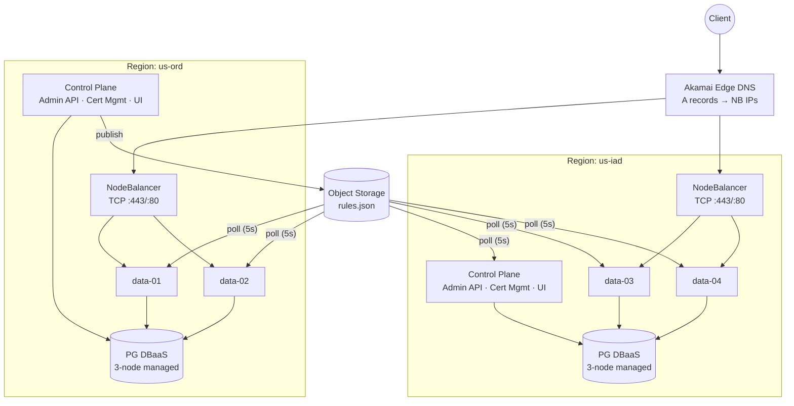
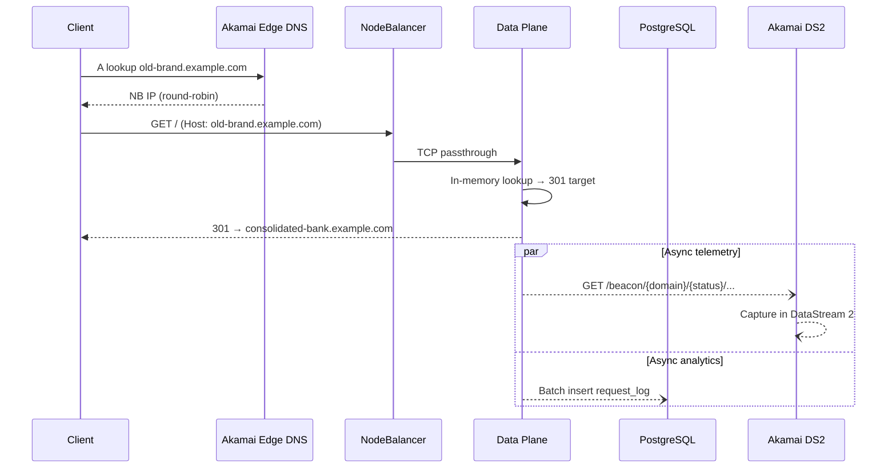
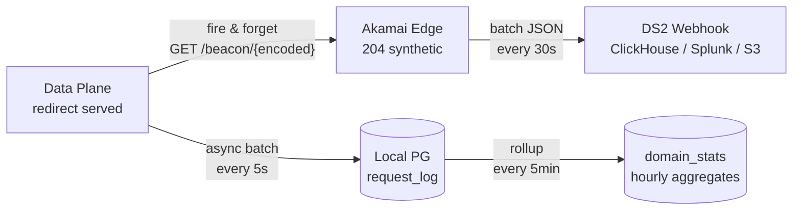
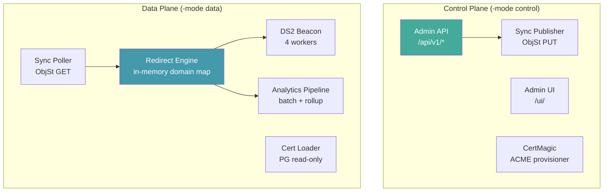

# TLD Redirect Engine

Multi-region, high-availability redirect engine for managing thousands of top-level domain (TLD) redirects. Built for enterprises consolidating legacy domain portfolios after mergers and acquisitions — replacing F5 appliances (single point of failure) with a distributed, observable, API-driven architecture.

## Architecture



**Single binary, `-mode` flag:**
- `-mode control` — Admin API, UI, cert provisioning (Let's Encrypt HTTP-01), ObjSt sync publisher
- `-mode data` — Redirect serving, DS2 beacon telemetry, analytics pipeline, cert reader
- No flag — legacy single-instance mode (SQLite, both planes combined)

## Request Flow



## Quick Start (Local Dev)

```bash
# Build (with SQLite support for local dev)
make build

# Run with sample data
./bin/tld-redirect -seed sample-data/redirects.json -token dev-token

# Admin UI:  http://localhost:8080/ui/?token=dev-token
# Redirects: curl -sI -H "Host: old-brand-financial.example.com" http://localhost:8081/
```

## Production Deployment

```bash
# Build for production (pure Go, no CGO — PostgreSQL only)
make build-pg

# Deploy control plane
make deploy-control SERVER=<ip> ENV=path/to/env

# Deploy data plane
make deploy-data SERVER=<ip> ENV=path/to/env
```

See [docs/runbook.md](docs/runbook.md) for full operational procedures.

## Key Features

| Feature | Description |
|---------|-------------|
| **Multi-region** | 2 regions, 2 data nodes per region, managed PG per region |
| **Control/data separation** | Control plane failure doesn't impact redirect serving |
| **Cross-region sync** | Object Storage (S3-compatible) replicates rules across regions in <10s |
| **On-demand TLS** | CertMagic provisions Let's Encrypt certs for each domain automatically |
| **DS2 beacon telemetry** | Every redirect fires a beacon to Akamai DataStream 2 for edge-level observability |
| **Analytics pipeline** | Async batch writes, hourly rollups, top paths/referers, inactive domain detection |
| **API + UI** | Full REST API with OpenAPI spec; embedded SPA for browsing and management |
| **Priority path matching** | Rules sorted by priority; first match wins. Supports exact and prefix matching |

## Observability: DS2 Beacon Pattern

See [docs/ds2-beacon.md](docs/ds2-beacon.md) for the detailed design of the DataStream 2 beacon integration — a fire-and-forget telemetry pattern that captures per-redirect metrics (domain, path, status, client IP, user agent, referer) at the edge with zero impact on redirect latency.



## Security: Akamai Integration Options

See [docs/akamai-integration.md](docs/akamai-integration.md) for notes on using Akamai API Gateway and App & API Protector in hybrid mode to add WAF/bot protection to the redirect infrastructure without moving serving logic to the edge.

## Control/Data Plane Separation



## Cost

| Resource | Spec | Monthly |
|----------|------|---------|
| PG DBaaS x 2 | 3-node Nanode per region | $74 |
| Data compute x 4 | Dedicated 4GB | $260 |
| Control compute x 2 | Dedicated 4GB | $130 |
| NodeBalancer x 2 | 1 per region | $20 |
| Object Storage | 1 bucket | $5 |
| **Total** | | **~$489/mo** |

## Project Structure

```
cmd/tld-redirect/          Entry point, -mode flag, startup branching
internal/
  redirect/engine.go        In-memory domain map, priority-based path matching
  store/store.go            Dual SQLite/PG store, BulkImportReplace, analytics
  analytics/pipeline.go     Async batch writer + 5-min rollup worker
  beacon/beacon.go          DS2 fire-and-forget HTTP beacon (4 workers)
  certs/certs.go            CertMagic provisioner (control) + loader (data)
  certs/pg_storage.go       certmagic.Storage backed by PG advisory locks
  sync/sync.go              S3 publish/poll with ETag-based change detection
  api/handlers.go           REST API with syncer integration
  api/middleware.go          Token auth, CORS, request logging
  server/mux.go             Host-based request routing
  ui/handler.go             Embedded SPA static assets
web/static/                 Admin UI (vanilla JS SPA)
terraform/
  modules/region/           PG, NB, instances, firewalls per region
  modules/dns/              Akamai Edge DNS A records
  environments/prod/        2-region production wiring
scripts/                    systemd units, deploy scripts
sample-data/                10 sample legacy domains for demo
```
