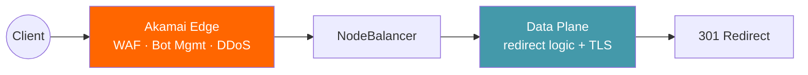

# Akamai Integration Options

## Current Integration

The redirect engine currently integrates with Akamai at two points:

1. **Akamai Edge DNS** — A records for apex domains point to NodeBalancer IPs; control plane hostnames resolve via Edge DNS (100% SLA)
2. **DataStream 2** — beacon telemetry for per-redirect observability (see [ds2-beacon.md](ds2-beacon.md))

## Hybrid WAF Protection with App & API Protector

The redirect infrastructure can be fronted by Akamai App & API Protector in hybrid mode to add WAF, bot management, and DDoS protection without moving redirect logic to the edge.

### How It Works

In hybrid mode, Akamai edge proxies traffic to the origin (NodeBalancer IPs) while applying App & API Protector policies. The redirect engine continues to handle all redirect logic, TLS termination, and domain routing — Akamai adds a security layer in front.

### Configuration Approach

1. **Create an Akamai property** per redirect domain (or use a wildcard/catch-all property)
2. **Set the origin** to the NodeBalancer IPs (both regions for failover)
3. **Enable App & API Protector** on the property with:
   - Adaptive Security Engine — automated WAF rule updates
   - Bot Manager — detect and mitigate automated traffic
   - Client Reputation — score-based throttling
   - Rate controls — protect against redirect loop abuse
4. **Forward Host header** — pass the original `Host` header to the origin so the redirect engine routes correctly
5. **Disable caching** — redirect responses (301/302) with `Location` headers should not be cached at edge, or cache with short TTL if redirect targets are stable

### API Gateway Option

For the control plane (admin API), Akamai API Gateway can provide:

- **API key management** — replace or supplement the query-string token auth
- **Rate limiting** — protect admin endpoints from abuse
- **Schema validation** — enforce OpenAPI spec compliance at the edge
- **OAuth/JWT integration** — enterprise SSO for the admin UI

This would involve creating a separate Akamai property for the control plane hostname (`tld-control-*.connected-cloud.io`) with API Gateway behaviors enabled.

### Trade-offs

| Approach | Pros | Cons |
|----------|------|------|
| **Direct to origin** (current) | Simplest, lowest latency, full control | No edge security layer |
| **Hybrid WAF** | WAF + bot + DDoS at edge, origin handles logic | Adds edge hop latency (~5-15ms), requires property per domain or SAN cert at edge |
| **Full edge redirect** | Akamai handles redirects via property rules | Limited to ~100 rules per property, no dynamic management, no analytics pipeline |

### Implementation Notes

- The hybrid approach requires Akamai to handle TLS for each domain at the edge. For 2000+ domains, this means either SAN certificates or individual certs per property — discuss with your Akamai account team for the most cost-effective approach.
- App & API Protector pricing is per-property, so consolidating domains into fewer properties (using SAN certs) reduces cost.
- The redirect engine's existing CertMagic setup continues to handle TLS at the origin. Akamai edge terminates TLS separately and re-encrypts to origin.
- Bot Manager signals can be passed downstream via headers (e.g., `Akamai-Bot-Score`) for the redirect engine to log in its analytics pipeline.
